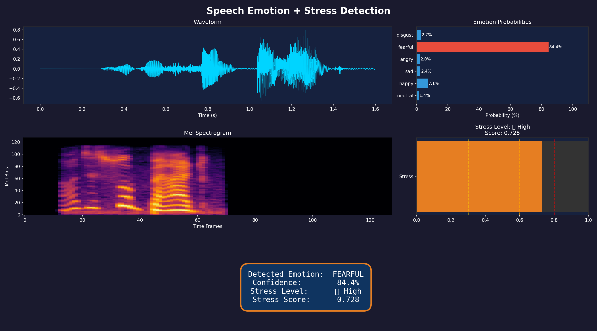
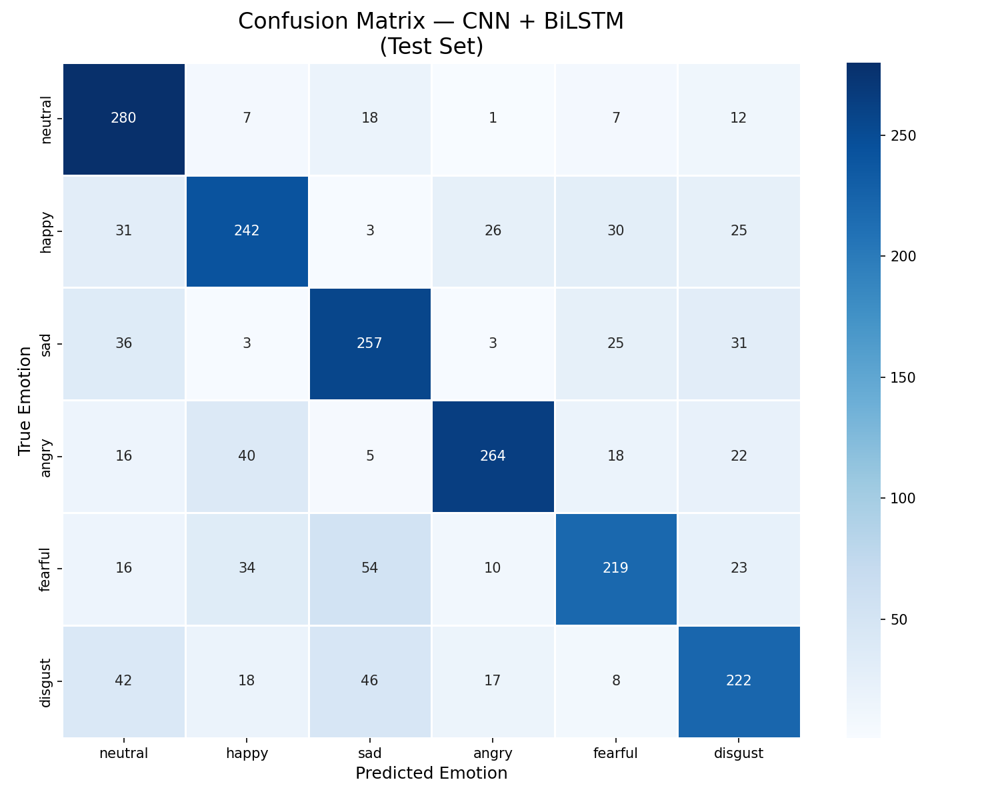
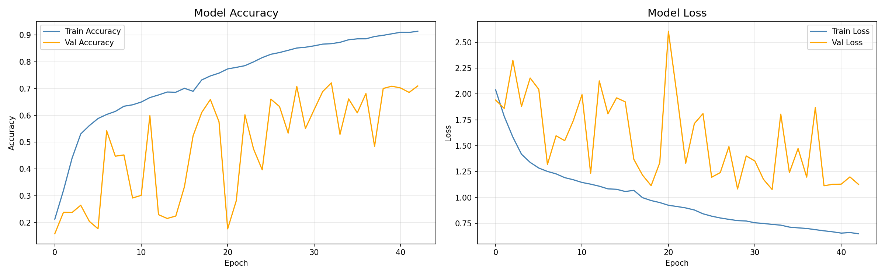

# Speech Emotion + Stress Detection
### Hybrid CNN + BiLSTM Deep Learning Model


---

## Overview
A hybrid deep learning system that detects **6 emotions** and derives 
**4 stress levels** from raw speech audio. Trained on 14,068 audio files 
across 5 public datasets using a CNN + BiLSTM architecture.

---

## Results

| Metric | Score |
|--------|-------|
| Test Accuracy | 70.30% |
| Val Accuracy (best) | 72.13% |
| Total Training Files | 14,068 |
| Architecture | CNN + BiLSTM |

### Per-Emotion Accuracy
| Emotion | Accuracy |
|---------|----------|
| Neutral | 86.2% |
| Sad     | 72.4% |
| Angry   | 72.3% |
| Happy   | 67.8% |
| Disgust | 62.9% |
| Fearful | 61.5% |

---

## Datasets Used
| Dataset | Files | Language |
|---------|-------|----------|
| CREMA-D | 7,338 | English  |
| TESS    | 4,800 | English  |
| RAVDESS | 1,056 | English  |
| EMO-DB  |   454 | German   |
| SAVEE   |   420 | English  |

---

## Architecture
```
Input (168, 128, 1)
       ↓
  CNN Block 1 → Conv2D(32) → BN → MaxPool → Dropout
  CNN Block 2 → Conv2D(64) → BN → MaxPool → Dropout  
  CNN Block 3 → Conv2D(128) → BN → MaxPool → Dropout
       ↓
  Reshape → sequence of CNN feature maps
       ↓
  BiLSTM(128, return_sequences=True)
  BiLSTM(64,  return_sequences=False)
       ↓
  Dense(128) → BN → Dropout
  Dense(64)  → Dropout
  Dense(6)   → Softmax
```

---

## Stress Detection
Emotions are mapped to a continuous stress score (0.0–1.0):

| Stress Level | Score Range | Emotions |
|---|---|---|
| Low      | 0.0 – 0.3 | Happy, Neutral |
| Moderate | 0.3 – 0.6 | Sad            |
| High     | 0.6 – 0.8 | Disgust, Fearful |
| Critical | 0.8 – 1.0 | Angry          |

---

## Demo Output




---

## Quick Start
```bash
pip install librosa tensorflow numpy soundfile
```
```python
from src.predict import predict

result = predict("your_audio.wav")
print(result)
# {
#   'emotion': 'angry',
#   'confidence': 84.4,
#   'stress_score': 0.728,
#   'stress_level': 'High'
# }
```

---

## Project Structure
```
├── notebooks/
│   ├── 01_data_loading.ipynb
│   └── 02_training_and_evaluation.ipynb
├── src/
│   ├── feature_extraction.py
│   └── predict.py
├── outputs/
│   ├── confusion_matrix.png
│   ├── training_curves.png
│   ├── per_emotion_accuracy.png
│   └── prediction_demo.png
├── models/
│   └── best_model.keras
└── README.md
```

---

## Tech Stack
- Python 3.10+
- TensorFlow / Keras
- Librosa
- NumPy, Pandas
- Scikit-learn
- Matplotlib, Seaborn

---

## Author
Built as part of a deep learning project on speech emotion recognition
and stress detection using hybrid CNN + BiLSTM architecture.
